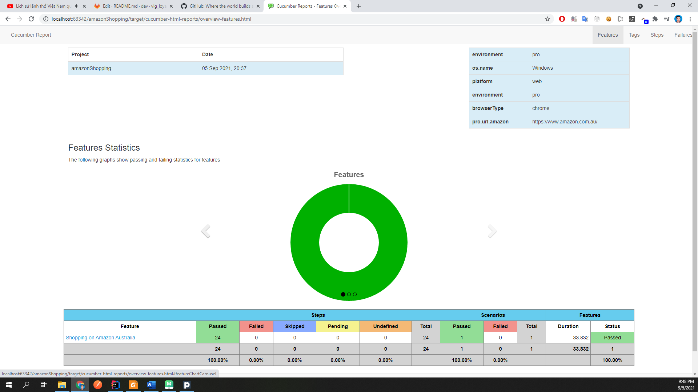

## Amazon Shopping - Automation Test Framework
Framework to write and run automation test. Based on : 'TestNG', 'Cucumber'.

## To Get Started

#### Pre-requisites
1. Install Java 11
2. Install maven version 3.8.1
3. Install chrome version >= 92

#### How to Run
* Fork this repo, keep the folder the structure intact
* Run the following maven command from command line 
```
mvn test -DsuiteXmlFile=src\test\java\TestSuites\testng.xml
```
* Run by right click on testng.xml
  
* The scripts should run successfully in **Chrome** browser as it is defined in the **config.properties** file.
* Target folder should be created with cucumber-html-report and surefire-reports.
* **Test_Output** folder should be created with the default testng reports

#### Writing Features
```
Feature: Shopping on Amazon Australia
  Scenario: User goes to Amazon Australia site and process shopping products
    Given I am on Amazon Australia site
    When I go to Home menu
    And I go to deal tab
```


#### Writing Step Definitions

```
public class homePageSteps extends WebBaseTest {
    //Instantiating homePage page using initElements()
    HomePage homePage = PageFactory.initElements(driver, HomePage.class);

    @When("I go to Home menu")
    public void iGoToHomeMenu() {
        homePage.goToHomeMenuAction();
    }
}
```


#### Cucumber Options

```
 @CucumberOptions(
        monochrome = true,
        features = "src/test/feature/amazonShopping.feature",
        glue = "stepDefinition",
        plugin = {"json:target/cucumber-reports/cucumber.json", "pretty"}
)

public class amazonShoppingRunner extends WebBaseTest {
}

```

#### HTML Reports
Default cucumber HTML reports are generated which can be customized according to specific needs
##### Success Cucumber Reports


